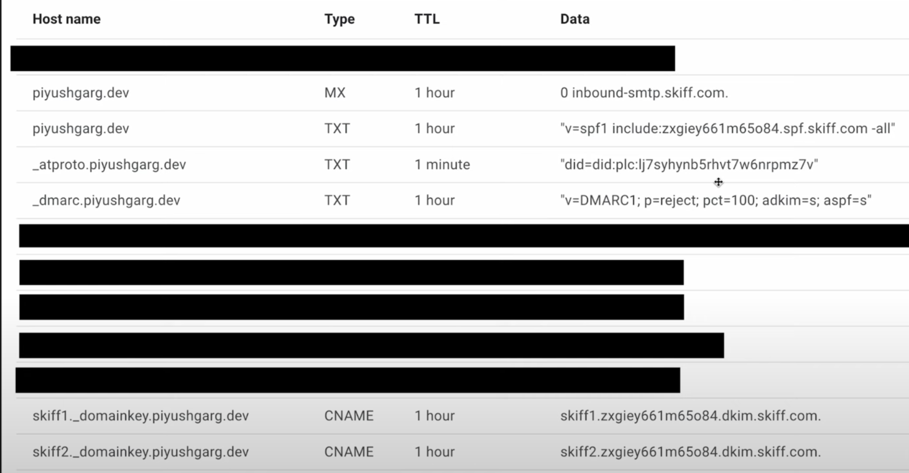

<h1 align="center">
 SMTP Server (mail server)
  <br>
</h1>

<p align="center">Allows users to deal with mail from server.</p>

<br>

# 🔗 Guidlines

## Tech Stack

- Node.js
- JavaScript
- SMTP Server


##  Key Points

DNS Record
- MX
- A
- SPF
- DKIM
- DMRAC

SMTP Communication

- HELO
- MAIL FRM
- RCPT TO
- DATA
- QUIT

<br>

<h1 align="center">  Screenshots  </h1>

<p align="center">
  
  
  
  
</p>

<h1 align="left">  Main Code  </h1>

```bash

const SMTPServer = require("smtp-server").SMTPServer;

const server = new SMTPServer({
  allowInsecureAuth: true,
  authOptional: true,
  onConnect(session, cb) {
    console.log(`onConnect`, session.id);
    cb(); //Accept the connection
  },

  onMailFrom(address, session, cb) {
    console.log(`onMailForm`, address.address, session.id);
    cb();
  },
  onRcptTo(address, session, cb) {
    console.log(`onRecptTo`, address.address, session.id);
    cb();
  },
  onData(stream, session, cb) {
    stream.on("data", (data) => console.log(`onData ${data.toString()}`));
    stream.on("end", cb);
  },
});

server.listen(25, () => console.log("Server Running on 25"));
```

<p align="center">
<b>Made with ❤️ by   <a href="https://github.com/Siratul804">  Siratul Islam </a> </b> 
</p>

<p align="center">
  <a href="https://github.com/Siratul804?tab=repositories">View Project</a> •
  <a href="https://github.com/Siratul804">GitHub Profile</a> •
  <a href="https://www.linkedin.com/in/siratulislam/">LinkedIn</a> •
  <a href="https://x.com/Siratul074">Twitter</a>
</p>

<p align="center">
  <small>© 2024 Siratul Islam. All rights reserved.</small>
</p>
